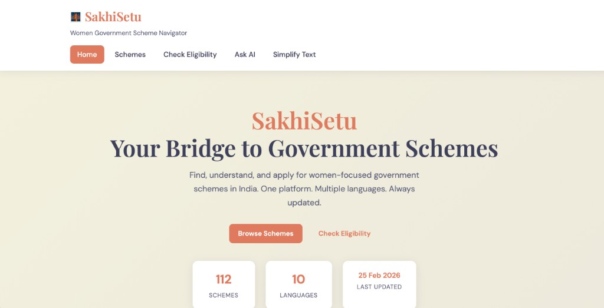
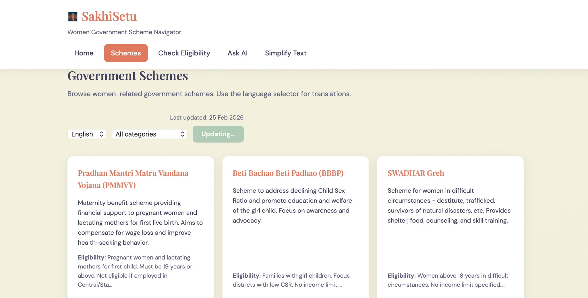
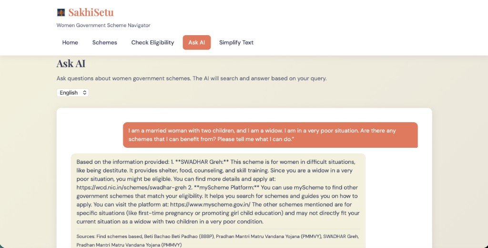
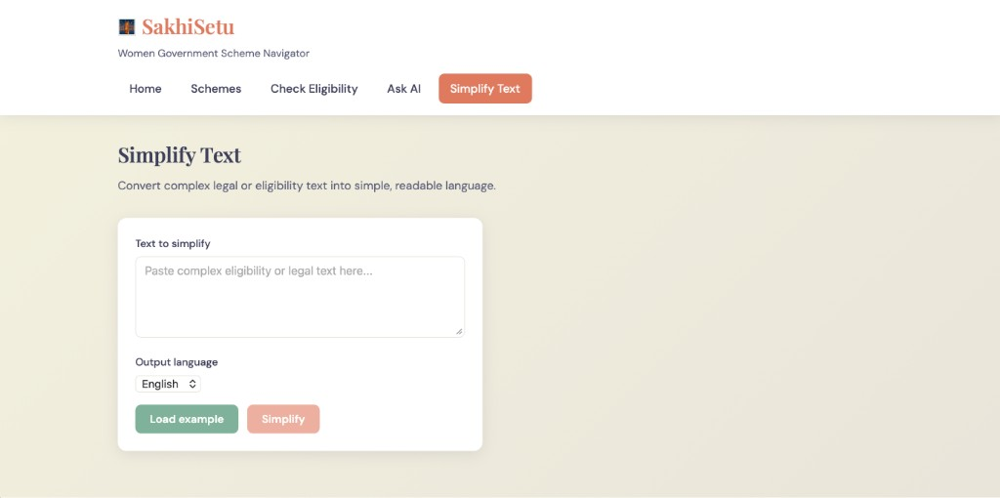
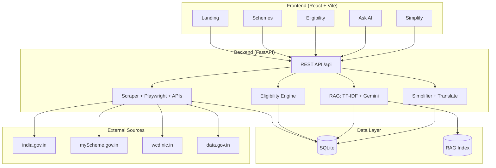

# SakhiSetu

<p align="center">
  <strong>AI-Powered Women Government Scheme Navigator</strong>
</p>

<p align="center">
  Find, understand, and apply for women-focused government schemes in India — one platform, multiple languages, always updated.
</p>

---

## Table of Contents

- [Problem Statement](#problem-statement)
- [Overview](#overview)
- [Key Features](#key-features)
- [Output](#output)
- [Tech Stack](#tech-stack)
- [Architecture](#architecture)
- [Project Structure](#project-structure)
- [Setup & Installation](#setup--installation)
- [Configuration](#configuration)
- [API Reference](#api-reference)
- [Multilingual Support](#multilingual-support)
- [Design Decisions](#design-decisions)
- [Roadmap](#roadmap)
- [References](#references)
- [License](#license)

---

## Problem Statement

### The Challenge

India has **hundreds of government schemes** aimed at women—covering maternity, education, livelihood, safety, and economic empowerment. Yet **discovery and access remain fragmented**:

1. **Information Scattered** — Schemes live across multiple ministries (WCD, Labour, Rural Development) and state portals. No single source of truth.

2. **Complex Eligibility** — Legal jargon, income thresholds, document requirements, and state-specific rules make it hard for citizens to self-assess eligibility.

3. **Language Barrier** — Official content is often in English. Regional language speakers struggle to understand and apply.

4. **Stale Data** — Scheme details change (benefits, deadlines, application links). Manual tracking is impractical.

5. **Low Awareness** — Many eligible women never learn about schemes they qualify for.

### Impact

- **Underutilization** of welfare programs
- **Delayed or missed benefits** for pregnant women, students, entrepreneurs
- **Trust deficit** due to opaque processes

---

## Overview

**SakhiSetu** (सखी सेतु — *Bridge of Companions*) is an end-to-end platform that:

| Capability | Description |
|------------|-------------|
| **Aggregates** | Scrapes and fetches schemes from india.gov.in, myScheme.gov.in, WCD, and APIs |
| **Stores** | Structured scheme data with benefits, eligibility, categories |
| **Matches** | Rule-based eligibility engine against user profile (income, state, age) |
| **Simplifies** | Converts legal/eligibility text to 8th-grade readable language |
| **Answers** | RAG-powered chatbot (TF-IDF + Gemini) for natural-language Q&A |
| **Translates** | 10 Indian languages via deep-translator |
| **Updates** | Scheduled scraping (APScheduler) keeps data current |

---

## Key Features

- **Scheme Discovery** — Browse 25+ schemes with benefits, categories, and application links
- **Instant Eligibility Check** — Enter profile once; see which schemes you qualify for
- **AI Chat** — Ask questions in plain language; get answers grounded in scheme data
- **Text Simplifier** — Paste complex eligibility text; get simple, translated output
- **Auto-Update** — Schemes refreshed from official sources on a configurable schedule
- **Multilingual** — English, Hindi, Tamil, Telugu, Marathi, Bengali, Gujarati, Kannada, Malayalam, Punjabi

---

## Output

### Home

Landing page with hero, key statistics (schemes count, languages, last updated), and call-to-action buttons.



### Schemes

Browse government schemes with language selector, category filter, and refresh. Each card shows name, description, eligibility, and Apply link.



### Ask AI

RAG-powered chatbot. Ask questions in natural language; get answers grounded in scheme data with source citations.



### Simplify Text

Convert complex legal or eligibility text into simple, readable language. Supports 10 Indian languages.



---

## Tech Stack

### Frontend

| Layer | Technology | Purpose |
|-------|------------|---------|
| **Framework** | React 18 | UI components, state management |
| **Routing** | React Router v6 | Client-side routing |
| **Build** | Vite 5 | Fast dev server, HMR, production bundling |
| **Styling** | CSS (custom properties) | Theming, responsive layout |

### Backend

| Layer | Technology | Purpose |
|-------|------------|---------|
| **API** | FastAPI | REST API, OpenAPI docs, async support |
| **Server** | Uvicorn | ASGI server |
| **Validation** | Pydantic v2 | Request/response schemas, config |
| **Database** | SQLAlchemy 2 | ORM, migrations |
| **Storage** | SQLite | Dev/default; PostgreSQL-ready |

### Data & Scraping

| Layer | Technology | Purpose |
|-------|------------|---------|
| **Static Scraping** | Requests + BeautifulSoup4 | HTML parsing for static sites |
| **Dynamic Scraping** | Playwright | JS-rendered pages (india.gov.in, myScheme) |
| **API Fetch** | Requests | data.gov.in, API Setu archive |
| **Scheduling** | APScheduler | Periodic scrape jobs |

### AI & NLP

| Layer | Technology | Purpose |
|-------|------------|---------|
| **Retrieval** | scikit-learn (TF-IDF) | Semantic search over scheme corpus |
| **Generation** | Google Gemini 2.5 Flash | RAG answer generation |
| **Translation** | deep-translator | 10-language output |
| **Simplification** | Rule-based (regex) | Legal → plain language |

### DevOps & Tooling

| Layer | Technology | Purpose |
|-------|------------|---------|
| **Config** | pydantic-settings + python-dotenv | 12-factor config |
| **Proxy** | Vite dev server | API proxy to backend |
| **Logging** | Python logging | Structured logs |

---

## Architecture

### System Diagram (Mermaid)



### Component Diagram (ASCII)

```
┌─────────────────────────────────────────────────────────────────────────────┐
│                              FRONTEND (React + Vite)                         │
│  ┌──────────┐ ┌──────────┐ ┌──────────┐ ┌──────────┐ ┌──────────┐          │
│  │ Landing  │ │ Schemes  │ │Eligibility│ │ Ask AI   │ │ Simplify  │          │
│  └────┬─────┘ └────┬─────┘ └────┬─────┘ └────┬─────┘ └────┬─────┘          │
│       │            │            │            │            │                 │
│       └────────────┴────────────┴────────────┴────────────┘                 │
│                              │ /api/* (proxy)                                │
└──────────────────────────────┼─────────────────────────────────────────────┘
                               ▼
┌─────────────────────────────────────────────────────────────────────────────┐
│                         BACKEND (FastAPI + Uvicorn)                          │
│  ┌─────────────────────────────────────────────────────────────────────┐   │
│  │                         API Routes (/api)                             │   │
│  │  /schemes  /stats  /scrape  /check-eligibility  /chat  /simplify     │   │
│  └─────────────────────────────────────────────────────────────────────┘   │
│       │              │              │              │                         │
│       ▼              ▼              ▼              ▼                         │
│  ┌─────────┐  ┌───────────┐  ┌───────────┐  ┌─────────────┐                   │
│  │ Scraper │  │Eligibility│  │   RAG     │  │ Simplifier │                   │
│  │Playwright│  │  Engine   │  │ TF-IDF + │  │ Rule-based │                   │
│  │  APIs   │  │           │  │  Gemini  │  │ + Translate│                   │
│  └────┬────┘  └─────┬─────┘  └────┬──────┘  └─────┬───────┘                   │
│       │             │             │              │                           │
│       └─────────────┴─────────────┴──────────────┘                           │
│                              │                                               │
│                              ▼                                               │
│  ┌─────────────────────────────────────────────────────────────────────┐   │
│  │                    SQLite / SQLAlchemy ORM                            │   │
│  │  schemes (id, name, description, eligibility, benefits, category…)   │   │
│  └─────────────────────────────────────────────────────────────────────┘   │
└─────────────────────────────────────────────────────────────────────────────┘
                               │
                               ▼
┌─────────────────────────────────────────────────────────────────────────────┐
│                         EXTERNAL SOURCES                                     │
│  india.gov.in  │  myScheme.gov.in  │  wcd.nic.in  │  data.gov.in  │ API Setu │
└─────────────────────────────────────────────────────────────────────────────┘
```

### Data Flow

1. **Ingestion** — Scraper (requests/Playwright) + API fetchers pull scheme data → DB
2. **Indexing** — TF-IDF vectorizer builds search index from scheme text
3. **Query** — User asks question → TF-IDF retrieves top-k schemes → Gemini generates answer
4. **Eligibility** — User profile → Rule engine checks each scheme → Returns eligible/not + reasons

---

## Project Structure

```
SakhiSetu/
├── app/                      # Backend application
│   ├── main.py               # FastAPI app, startup, scheduler
│   ├── routes.py             # API route handlers
│   ├── models.py             # SQLAlchemy Scheme model
│   ├── schemas.py            # Pydantic request/response schemas
│   ├── database.py           # Engine, session, migrations
│   ├── config.py             # Settings from .env
│   ├── scraper.py            # Multi-URL scraper (requests + BeautifulSoup)
│   ├── scraper_playwright.py # Playwright for JS sites
│   ├── scheme_apis.py        # data.gov.in, API Setu fetchers
│   ├── eligibility.py        # Rule-based eligibility engine
│   ├── simplifier.py         # Legal text → plain language
│   ├── rag.py                # TF-IDF retrieval + Gemini generation
│   └── translate.py          # Multilingual (deep-translator)
├── frontend/
│   ├── src/
│   │   ├── pages/            # Landing, Schemes, Eligibility, Chat, Simplify
│   │   ├── components/       # Layout, nav
│   │   ├── api.js            # API client
│   │   └── main.jsx
│   ├── package.json
│   └── vite.config.js
├── .env.example
├── requirements.txt
├── sakhisetu.db              # SQLite DB (created on first run)
├── rag_index.pkl             # TF-IDF index (created on startup)
└── README.md
```

---

## Setup & Installation

### Prerequisites

- **Python 3.10+** (3.14 supported)
- **Node.js 18+**
- **npm** or **pnpm**

### Backend

```bash
# 1. Clone and enter project
cd SakhiSetu

# 2. Create virtual environment
python -m venv venv
source venv/bin/activate          # Windows: venv\Scripts\activate

# 3. Install dependencies
pip install -r requirements.txt

# 4. Install Playwright browser (for JS-rendered sites)
playwright install chromium

# 5. Configure environment
cp .env.example .env
# Edit .env: set GEMINI_API_KEY (required for Ask AI)

# 6. Run server
uvicorn app.main:app --reload --host 0.0.0.0 --port 8000
```

**API docs:** http://localhost:8000/docs

### Frontend

```bash
cd frontend
npm install
npm run dev
```

**App:** http://localhost:5173 (proxies `/api` to backend)

---

## Configuration

| Variable | Default | Description |
|----------|---------|-------------|
| `GEMINI_API_KEY` | — | **Required for Ask AI.** Get from [Google AI Studio](https://aistudio.google.com/app/apikey) |
| `DATABASE_URL` | `sqlite:///./sakhisetu.db` | DB connection string |
| `SCRAPE_URLS` | india.gov.in, myScheme, wcd.nic.in | Comma-separated URLs to scrape |
| `AUTO_SCRAPE_HOURS` | `24` | Scrape interval (0 = disabled) |
| `USE_PLAYWRIGHT` | `true` | Use Playwright for JS sites |
| `USE_APIS` | `true` | Fetch from data.gov.in, API Setu |
| `DATA_GOV_IN_API_KEY` | — | Optional: data.gov.in API key |
| `GEMINI_MODEL` | `gemini-2.5-flash` | Gemini model name |
| `LOG_LEVEL` | `INFO` | Logging level |

---

## API Reference

| Method | Endpoint | Description |
|--------|----------|-------------|
| GET | `/api/schemes?lang=` | List schemes (translated) |
| GET | `/api/stats` | Total schemes, last updated |
| POST | `/api/scrape` | Scrape and update schemes |
| POST | `/api/check-eligibility` | Check profile against all schemes |
| POST | `/api/chat` | RAG chatbot Q&A |
| POST | `/api/simplify` | Simplify legal text |
| POST | `/api/chat/reindex` | Rebuild RAG index |
| GET | `/api/languages` | Supported languages |

Full OpenAPI spec: http://localhost:8000/docs

---

## Multilingual Support

| Code | Language |
|------|----------|
| en | English |
| hi | Hindi (हिन्दी) |
| ta | Tamil (தமிழ்) |
| te | Telugu (తెలుగు) |
| mr | Marathi (मराठी) |
| bn | Bengali (বাংলা) |
| gu | Gujarati (ગુજરાતી) |
| kn | Kannada (ಕನ್ನಡ) |
| ml | Malayalam (മലയാളം) |
| pa | Punjabi (ਪੰਜਾਬੀ) |

Use `lang` query param or request body field on schemes, eligibility, simplify, and chat endpoints.

---

## Design Decisions

| Decision | Rationale |
|----------|-----------|
| **TF-IDF over embeddings** | No external vector DB; works on Python 3.14; ChromaDB had compatibility issues |
| **Gemini over OpenAI** | Free tier; good for Indian context; single API key |
| **Rule-based eligibility** | Transparent, auditable; no black-box ML |
| **Rule-based simplification** | Deterministic; no LLM cost for this path |
| **Playwright for JS sites** | india.gov.in, myScheme are SPAs; requests return "Loading..." |
| **SQLite default** | Zero-config dev; swap to PostgreSQL for production |
| **APScheduler** | Lightweight; no Redis/Celery for simple cron-like jobs |

---

## Roadmap

- [ ] **LLM-based simplification** — Semantic simplification via Gemini
- [ ] **Embedding-based RAG** — Replace TF-IDF with vector search
- [ ] **PostgreSQL + Alembic** — Production DB with migrations
- [ ] **Redis caching** — Scheme list, eligibility results
- [ ] **Rate limiting** — Per-IP / per-user
- [ ] **Authentication** — User profiles, saved eligibility checks
- [ ] **State-specific schemes** — Filter by state, richer eligibility
- [ ] **myScheme API** — Direct integration when public API available

---

## References

### Government Portals

- [National Portal of India — Schemes](https://www.india.gov.in/my-government/schemes)
- [myScheme — Government Scheme Marketplace](https://www.myscheme.gov.in/)
- [Ministry of Women & Child Development](https://wcd.nic.in/schemes)
- [Open Government Data (data.gov.in)](https://data.gov.in/)
- [API Setu — Government API Platform](https://apisetu.gov.in/)

### Technologies

- [FastAPI](https://fastapi.tiangolo.com/)
- [React](https://react.dev/)
- [Google Gemini API](https://ai.google.dev/)
- [Playwright](https://playwright.dev/python/)
- [SQLAlchemy](https://www.sqlalchemy.org/)

---

## License

MIT License. See [LICENSE](LICENSE) for details.
